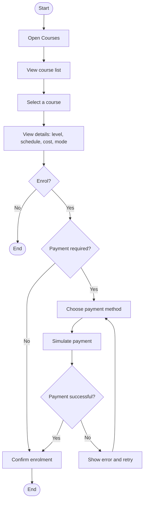
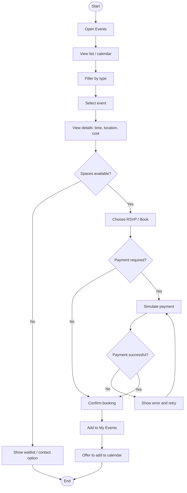
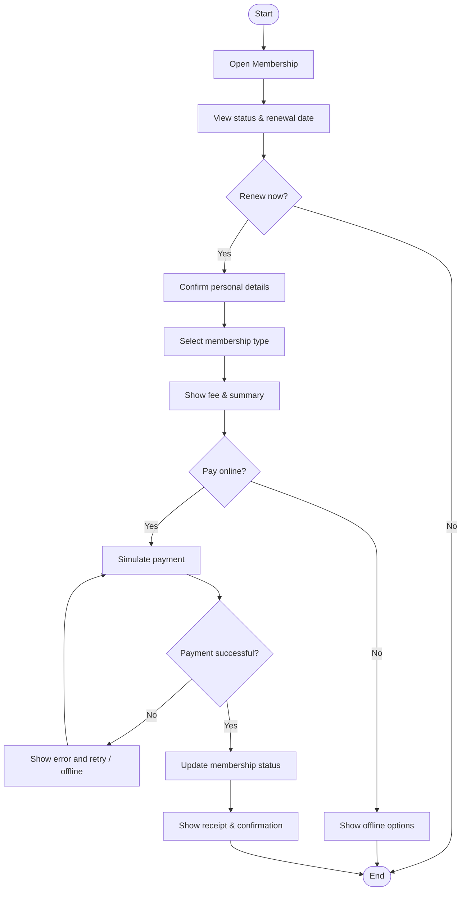

# KICC Community App Prototype

This repository contains a Flutter/Material3 prototype for the KICC community mobile application with support for short courses.  The prototype is designed according to the specifications of Assignment 2 and demonstrates the major user flows derived from the activity diagrams defined in Assignment 1.

## Repository Structure

```
assignment2_prototype/
│
├── pubspec.yaml             # Flutter project configuration
├── lib/
│   ├── main.dart            # Application entry point
│   └── screens/             # Individual screen widgets
│       ├── home_screen.dart
│       ├── courses_screen.dart
│       ├── course_detail_screen.dart
│       ├── course_enrolment_screen.dart
│       ├── events_screen.dart
│       ├── event_detail_screen.dart
│       ├── event_booking_screen.dart
│       ├── prayer_request_screen.dart
│       ├── donation_screen.dart
│       ├── membership_screen.dart
│       └── renew_membership_screen.dart
└── README.md                # Project overview and diagrams (this file)
```

All screens are integrated into a single Flutter application via named routes defined in `main.dart`.  The prototype focuses on layout and interaction patterns; it does not include backend connectivity or persistent state.

## Running the Prototype

This project is intended to be run on [DartPad](https://dartpad.dev/) or within a local Flutter development environment (e.g. VS Code). To run locally:

1. Install Flutter (version 3.1 or later).
2. Navigate to the `assignment2_prototype` directory.
3. Run `flutter pub get` to fetch dependencies.
4. Launch the app using `flutter run` or your preferred IDE.

## Activity Diagrams

Below are the Mermaid definitions for the activity diagrams referenced in Assignment 1.  You can copy these into a Mermaid editor or into the draw.io _Insert → Advanced → Mermaid_ dialog to render them.

### 1. Enrol in Course



### 2. Book an Event (RSVP)



### 3. Renew Membership



## Further Improvements

- **Material3 compliance**: The prototype uses Material3 via `ThemeData(useMaterial3: true)`.  You can further refine colours, typography and component styling by customizing the colour scheme in `main.dart`.
- **Data models**: Currently all data is hard‑coded.  In a complete app these would be replaced with models and fetched from a backend service.
- **State management**: For simplicity, state is managed locally within each screen.  A more robust implementation might use a state management solution such as Provider or Riverpod.
- **Navigation**: Navigation is achieved via named routes and `Navigator.pushNamed()`.  Feel free to adopt more advanced navigation patterns if needed.

When submitting your assignment, ensure you provide a link to this repository in your Word document along with your task analysis and activity diagrams.